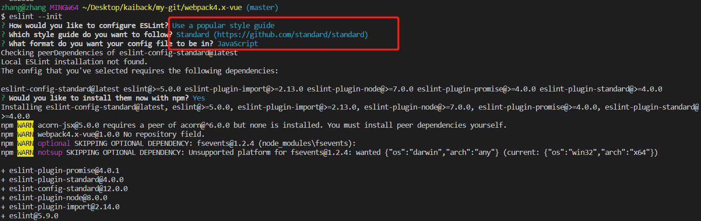

# webpack4 搭建 Vue 开发环境笔记

# 一、node 知识

[\_\_dirname](http://nodejs.cn/api/modules.html#modules_dirname): 获取当前文件所在路径，等同于 path.dirname(\_\_filename)

```javascript
console.log(__dirname);
// Prints: /Users/mjr
console.log(path.dirname(__filename));
// Prints: /Users/mjr
```

[path.resolve([..paths])](http://nodejs.cn/api/path.html#path_path_resolve_paths): 把一个路径或路径片段的序列解析为一个绝对路径

> -   给定的路径的序列是从右往左被处理的，后面每个 path 被依次解析，直到构造完成一个绝对路径
> -   如果处理完全部给定的 path 片段后还未生成一个绝对路径，则当前工作目录会被用上
> -   生成的路径是规范化后的，且末尾的斜杠会被删除，除非路径被解析为根目录
> -   长度为零的 path 片段会被忽略
> -   如果没有传入 path 片段，则 path.resolve() 会返回当前工作目录的绝对路径

```javascript
path.resolve('/foo/bar', './baz');
// 返回: '/foo/bar/baz'

path.resolve('/foo/bar', '/tmp/file/');
// 返回: '/tmp/file'

path.resolve('wwwroot', 'static_files/png/', '../gif/image.gif');
// 如果当前工作目录为 /home/myself/node，
// 则返回 '/home/myself/node/wwwroot/static_files/gif/image.gif'
```

# 二、配置最基本的 webpack

项目目录生成如下文件

```
.
├── build
│   ├── build.js
│   ├── index.html
│   ├── webpack.base.conf.js
│   ├── webpack.dev.conf.js
│   └── webpack.prod.conf.js
├── package.json
├── package-lock.json
└── src
    ├── App.vue
    ├── main.js
    ├── timg.gif
    └── timg.jfif
```

首先，先装下 webpack 依赖：

```
npm i webpack webpack webpack-cli -D
```

## 1、webpack.base.conf.js

```javascript
const path = require('path');
const HtmlWebpackPlugin = require('html-webpack-plugin');
module.exports = {
  entry: {
    bundle: path.resolve(__dirname, '../src/main.js')
  },
  output: {
    path: path.resolve(__dirname, '../dist'),
    filename: '[name].[hash].js',
    publicPath: '/'
  },
  module: {
    rules: [

    ]
  },
  plugins: [
    <!-- 以当前目录的index.html为模板生成新的index.html，这个插件就是将新生成的文件（js,css）引入 -->
    new HtmlWebpackPlugin({
      template: path.resolve(__dirname, 'index.html')
    })
  ],
  resolve: {

  }
};
```

上面用到了 html-webpack-plugin 插件，装下：

```javascript
npm i html-webpack-plugin -D
```

## 2、webpack.dev.conf.js

```javascript
const merge = require('webpack-merge');
const path = require('path');
const baseConfig = require('./webpack.base.conf');
module.exports = merge(baseConfig, {
  // mode关系到代码压缩质量  https://webpack.docschina.org/guides/tree-shaking/
  mode: 'development',
  // source-map,将编译后的代码映射到原代码，便于报错后定位错误
  devtool: 'inline-source-map',
  <!-- webpack-dev-server配置项 -->
  devServer: {
    <!-- devserver启动服务的根路径 -->
    contentBase: path.resolve(__dirname, '../dist'),
    <!-- 打开浏览器 -->
    open: true
  }
});
```

合并 webpack 配置的插件 webpack-merge，能够启一个简易服务的 webpack-dev-server，[详情](https://webpack.docschina.org/configuration/dev-server/)

```
npm i webpack-dev-server webpack-merge -D
```

## 3、webpack.prod.conf.js

```javascript
const merge = require('webpack-merge');
const CleanWebpackPlugin = require('clean-webpack-plugin');
const path = require('path');
const baseConfig = require('./webpack.base.conf');
module.exports = merge(baseConfig, {
    mode: 'production',
    devtool: 'source-map',
    module: {
        rules: [],
    },
    plugins: [
        new CleanWebpackPlugin(['dist/'], {
            root: path.resolve(__dirname, '../'),
        }),
    ],
});
```

清除文件的插件：

```
npm i clean-webpack-plugin -D
```

## 4、build.js

```javascript
const webpack = require('webpack');
const config = require('./webpack.prod.conf');

webpack(config, (err, stats) => {
    if (err || stats.hasErrors()) {
        // 在这里处理错误
        console.error(err);
        return;
    }
    // 处理完成
    console.log(
        stats.toString({
            chunks: false, // 使构建过程更静默无输出
            colors: true, // 在控制台展示颜色
        })
    );
});
```

## 5、[npm scripts](http://www.ruanyifeng.com/blog/2016/10/npm_scripts.html)

```javascript
// package.json
{
  +++
  "scripts": {
    "build": "node build/build.js",
    "dev": "webpack-dev-server --inline --progress --config build/webpack.dev.conf.js"
  },
}
```

以上算是一个 webpack 的基本结构，如果入口文件（main.js）里引入的是正经 js，npm dev 和 npm build 是可以的打包编译的，但是我们是要写 vue，那就要加些 loader 和 plugins 了

# 三、引入一些基本的 loader

## 1、babel-loader

依赖安装要求：webpack 4.x | babel-loader 7.x | babel 6.x,注意 babel-loader 和 babel 的版本，不然会报错

```
npm install -D babel-loader@7 babel-core babel-preset-env webpack
```

然后再配置中加入

```javascript
// base.conf.js
module.exports = {
  +++
  module: {
    rules: [
      {
        test: /\.js$/,
        exclude: /node_modules/,
        use: {
          loader: 'babel-loader',
        }
      },
      +++
    ]
  }
}
```

我们还需要添加一个配置文件（.babelrc，为 babel-preset-env 配置）在根目录下：

```javascript
/// .babelrc
{
  "presets": [
    ["env", {
      "targets": {
        "browsers": [">0.25%", "last 2 versions", "not ie 11", "not op_mini all"]
      }
    }]
  ]
}
```

这就是 babel-preset-env 的作用，帮助我们配置 babel。我们只需要告诉它我们要兼容的情况（目标运行环境），它就会自动把代码转换为兼容对应环境的代码。
以上代码表示我们要求代码兼容最新两个版本的浏览器，不用兼容 11(及以下)和 Opera Mini，另外市场份额超过 0.25% 的浏览器也必须支持。
只需要告诉 babel-preset-env 你想要兼容的环境，它就会自动转换

## 2、url-loader、file-loader

如果我们希望在页面引入图片（包括 img 的 src 和 background 的 url）。当我们基于 webpack 进行开发时，引入图片会遇到一些问题

其中一个就是引用路径的问题。拿 background 样式用 url 引入背景图来说，我们都知道，webpack 最终会将各个模块打包成一个文件，因此我们样式中的 url 路径是相对入口 html 页面的，而不是相对于原始 css 文件所在的路径的。这就会导致图片引入失败。这个问题是用 file-loader 解决的，file-loader 可以解析项目中的 url 引入（不仅限于 css），根据我们的配置，将图片拷贝到相应的路径，再根据我们的配置，修改打包后文件引用路径，使之指向正确的文件

另外，如果图片较多，会发很多 http 请求，会降低页面性能。这个问题可以通过 url-loader 解决。url-loader 会将引入的图片编码，生成 dataURl。相当于把图片数据翻译成一串字符。再把这串字符打包到文件中，最终只需要引入这个文件就能访问图片了。当然，如果图片较大，编码会消耗性能。因此 url-loader 提供了一个 limit 参数，小于 limit 字节的文件会被转为 DataURl，大于 limit 的还会使用 file-loader 进行 copy。

url-loader 和 file-loader 是什么关系呢？简答地说，url-loader 封装了 file-loader。url-loader 赖于 file-loader，即使用 url-loader 时，也要安装 file-loader

```
npm i url-loader file-loader -D
```

```javascript
/// base.conf.js
module.exports = {
  +++
  module: {
    rules: [
      +++
      {
        test: /\.(png|jpg|jfif|jpeg|gif)$/,
        use: [
          {
            loader: 'url-loader',
            options: {
              // 低于这个limit就直接转成base64插入到style里，不然以name的方式命名存放
              // 这里的单位时bit
              limit: 8192,
              name: 'static/images/[hash:8].[name].[ext]'
            }
          }
        ]
      },
      // 字体图标啥的，跟图片分处理方式一样
      {
        test: /\.(woff|woff2|eot|ttf|otf)$/,
        use: [
          {
            loader: 'url-loader',
            name: 'static/font/[hash:8].[name].[ext]'
          }
        ]
      },
    ]
  },
}
```

## 3、[vue-loader](https://vue-loader.vuejs.org/zh/#vue-loader-%E6%98%AF%E4%BB%80%E4%B9%88%EF%BC%9F)

作用自己去看

```
npm i vue-loader -D
```

```javascript
// base.conf.js
module.exports = {
  +++
  module: {
    rules: [
      +++
      {
        test: /\.vue$/,
        loader: 'vue-loader'
      }
    ]
  }
}

```

在这里还要一个插件，这个插件是必须的！

```javascript
// base.conf.js
const VueLoaderPlugin = require('vue-loader/lib/plugin')
module.exports = {
  +++
  plugins: [
      // 它的职责是将你定义过的其它规则复制并应用到 .vue 文件里相应语言的块。
      // 例如，如果你有一条匹配 /\.js$/ 的规则，那么它会应用到 .vue 文件里的 <script> 块
      new VueLoaderPlugin(),
      +++
  ]
}
```

## 4、处理样式

-   less-loader: 将 less 转 css
-   css-loader: 将 css 转为 CommonJS 规范的 js 字符串
-   style-loader: 将 js 字符串转为 style node 插入到 html 中
-   postcss-loader: PostCSS 是一个允许使用 JS 插件转换样式的工具，我们用 postcss 的插件就要配置它，autoprefixer 就是 postcss 项目里的一个插件
-   autoprefixer: 添加了 vendor 浏览器前缀，它使用 Can I Use 上面的数据。
    <!-- * stylelint: 可以让你在编译的时候就知道自己CSS文件里的错误
      * install stylelint-webpack-plugin
      * stylelint-config-standard: stylelint语法，使用标准语法 -->

```
npm i less-loader css-loader style-loader less autoprefixer postcss-loader -D
```

```javascript
const StyleLintPlugin = require('stylelint-webpack-plugin');
// base.conf.js
module.exports = {
  +++
  module: {
    rules: [
      {
        // less css
        test: /\.l?css$/,
        // use里的loader执行顺序为从下到上，loader的顺序要注意
        // 这里检测到less/css文件后需要将后续处理loader都写在此use里,如果less和css过分开检测处理，不能说先用less-loader转成css，然后让它走/\.css/里的use
        use: [
          {loader: 'style-loader'},
          {loader: 'css-loader'},
          {loader: 'postcss-loader'},
          {loader: 'less-loader'},
        ]
      },
      +++
    ]
  }
}

```

-   配置 postcss
    > 在根目录新建个 postcss.config.js 文件来配置 autoprefixer，通过[Browerslist](https://github.com/browserslist/browserslist)来帮助你配置，浏览器市场份额，了解下[browserl.ist](https://browserl.ist/)

```javascript
module.exports = {
    plugins: [
        require('autoprefixer')({
            browsers: ['defaults', 'not ie < 9', 'last 2 versions', '> 1%', 'iOS 7', 'last 3 iOS versions'],
        }),
    ],
};
```

-   mini-css-extract-plugin 提取 css
    > 这里打包`css`以`less`为例，r 如果要用`mini-css-extract-plugin`插件提取`css`，将上面改为如下：

```
npm install mini-css-extract-plugin -D
```

```javascript
const MiniCssExtractPlugin = require('mini-css-extract-plugin')
+++
module.exports = {
  +++
  // 模块，loader
  module: {
    rules: [
      +++
      {
        test: /\.l?(c|e)ss$/,
        use: [
          MiniCssExtractPlugin.loader,
          {loader: 'css-loader'},
          {loader: 'postcss-loader'},
          {loader: 'less-loader'},
        ]
      },
      +++
    ]
  },
  // 插件
  plugins: [
    +++
    new MiniCssExtractPlugin({
      filename: 'static/css/[name].[hash].css',
      chunkFilename: 'static/css/[name].[hash].css'
    })
  ]
}
```

## 5、然后配置下别名 resolve.extensions

```javascript
// base.conf.js
module.exports = {
  +++
  resolve: {
    alias: {
      // 配置别名'vue$'，不然import 'vue'时，webpack找不到
      'vue$': 'vue/dist/vue.esm.js',
      // 这个为src配置别名，非必需，为方便而已
      '@': path.resolve(__dirname, '../src')
    },
    // 在import这些拓展名的文件时，可以省略拓展名
    extensions: ['*', '.js', '.json', '.vue'],
  }
}
```

现在我们来测试以下，安装一个 vue

```
npm i vue
```

在 mian.js 里面

```javascript
import Vue from 'vue';
import App from './App';

new Vue({
    el: '#app',
    components: { App },
    template: '<App/>',
});
```

在 App.vue 里写入

```javascript
<template>
  <div>
    <h3 class="title">{{title}}</h3>
    <p class="content">{{content}}</p>
    <div class="goddess">
      <div class="right">
        <h4 class="right__h4">background引入图片</h4>
        <div class="right__img"></div>
      </div>
      <div class="left">
        <h4 class="left__h4">img标签直接引入图片</h4>
        
      </div>
    </div>
  </div>
</template>

<script>
export default {
  components: {
    Foot: Footer
  },
  data () {
    return {
      title: 'hello word',
      content: 'webpack4 搭建vue环境',
    }
  },
}
</script>


<style lang="less" scoped>
  .title {
    font-size: 20px;
    text-align: center;
    color: red;
  }
  .content {
    font-size: 14px;
    color: #333333;
  }
  .goddess {

    .left {
      margin-left: 50%;
      &__h4 {
        font-size: 14px;
      }
      &__img {
        width: 308px;
        height: 433px;
      }
    }
    .right {
      float: left;
      &__h4 {
        font-size: 14px;
      }
      &__img {
        width: 300px;
        height: 150px;
        background: url('./timg.gif') no-repeat;
      }
    }
  }
</style>

```

好了，npm dev 先看一下女神，放松一下：


# 四、做一些优化

## 1、提取公共代码

使用 splitChucksPlugin 插件，这是 Webpack 自带的，不用安装第三方依赖，默认配置即可

```javascript
<!-- base.conf.js -->
module.exports = {
  +++
  plugins: [
    +++
    new webpack.optimize.SplitChunksPlugin()
  ]
}
```

想了解这个插件的默认配置及如何配置，[英文](https://webpack.docschina.org/plugins/split-chunks-plugin/)，[中文](https://lengxing.club/2018/09/18/2018-09-18/)

## 2、将第三方库单独打包

每次我们对项目进行打包时，我们都会把引用的第三方依赖给打包一遍，比如 Vue、Vue-Router、React 等等。但是这些库的代码基本都是不会变动的，我们没必要每次打包都构建一次，所以我们最好将这些第三方库提取出来单独打包，这样有利于减少打包时间。
官方插件是 [DllPlugin](https://webpack.docschina.org/guides/code-splitting/)。推荐一个比较好用的插件 —— autodll-webpack-plugin

```
npm i autodll-webpack-plugin -D
```

```javascript
// base.conf.js
module.exports = {
  +++
  plugins: [
   // 将一些不太可能改动的第三方库单独打包，会通过缓存极大提升打包速度
    new AutoDllPlugin({
      // will inject the DLL bundle to index.html
      // default false
      inject: true,
      debug: false,
      filename: '[name]_[hash].js',
      path: 'static',
      entry: {
        // [name] = vue, 在这里会将entry里的每个item(vue,jquery)都打包成一个js
        vue: [
          'vue',
          'vue-router'
        ],
        // [name] = jquery
        // jquery: [
        //   'jquery',
        //   'jquery-from'
        // ]
      }
    }),
    +++
  ]
}
```

inject 为 true，插件会自动把打包出来的第三方库文件插入到 HTML。filename 是打包后文件的名称。path 是打包后的路径。entry 是入口，vendor 是你指定的名称，数组内容就是要打包的第三方库的名称，不要写全路径，Webpack 会自动去 node_modules 中找到的。
每次打包，这个插件都会检查注册在 entry 中的第三方库是否发生了变化，如果没有变化，插件就会使用缓存中的打包文件，减少了打包的时间，这时 Hash 也不会变化。

## 3、热重载

“热重载”不只是当你修改文件的时候简单重新加载页面。启用热重载后，当你修改 .vue 文件时，该组件的所有实例将在不刷新页面的情况下被替换。它甚至保持了应用程序和被替换组件的当前状态！当你调整模版或者修改样式时，这极大地提高了开发体验，以下两种方式择一即可

-   方式 1：启动的时候通过`--hot`选项就 ok 了，[webpack](https://webpack.docschina.org/configuration/dev-server/#devserver-hot)，[vue-loader](https://vue-loader.vuejs.org/zh/guide/hot-reload.html#%E7%8A%B6%E6%80%81%E4%BF%9D%E7%95%99%E8%A7%84%E5%88%99)

```javascript
"scripts": {
  +++
  "dev": "webpack-dev-server --hot --inline --progress --config build/webpack.dev.conf.js"
},
```

-   方式 2：或者通过配置 webpack.dev.config.js，相比第一种，就会麻烦一点

```javascript
const webpack = require('webpack')
module.exports = {
  +++
  module: {
    devServer: {
      +++
      // 开启热重载
      hot: true
    },
    plugins: [
      // 启用模块热替换(HMR)
      new webpack.HotModuleReplacementPlugin(),
      // 当开启 HMR 的时候使用该插件会显示模块的相对路径，建议用于开发环境。
      new webpack.NamedModulesPlugin(),
      +++
    ]
  }
}
```

## 4、eslint

确保 `VS Code` 安装了 `Vetur（设置编辑器支持vue文件，如果写过vue忽略）` 和 `Eslint` 插件

```
npm i -g eslint@latest

eslint --init
```

然后选个最流行的就行了


会帮你新建一个.eslintrc.js 的配置文件以及装一些 eslint 的依赖

在 package.json 里加上：

```javascript
{
  +++
  "scripts": {
    +++
    "lint": "eslint --ext .js,.vue src"
  },
}
```

你可以尝试的`npm run lint`，你会发现`spacing 系列`、`no-new`、`.vue语法不支持`等问题
当然，你可以通过改写 lint 命令（加个`--fix`）来解决部分语法报错

```JavaScript
{
  +++
  "scripts": {
    +++
    "lint": "eslint --fix --ext .js,.vue src"
  },
}
```

或者保存的时候让 eslint 插件自动修复。 更改 VS Code 中的 eslint.autoFixOnSave 设置，勾选文本编辑->Format On Save
当然这玩法不是我们这里的重点，安装 eslint-plugin-html 来解决 vue 语法 eslint 报错问题

```
npm install -D eslint-plugin-html
```

在.eslintrc.js 中配置 eslint-plugin-html

```javascript
module.exports = {
    +++
    "plugins": [
      // 使用eslint-plugin-html
      "html"
    ]
};
```

至于 main.js 里的 new 指定给变量错误 disable 掉

```javascript
+++
/* eslint-disable no-new */
new Vue({
  el: '#app',
  components: {
    App
  },
  template: '<App/>'
})
```

-   代码如果 eslint 有报错，就让编译不通过

```
npm i eslint-loader babel-eslint -D
```

```javascript
<!-- .eslintrc.js -->
{
  +++
  "parser": "babel-eslint"
}

```

```javascript
<!-- base.config.js -->
module.exports = {
  module: {
    rules: [
      {
        test: /\.(vue|js)$/,
        loader: 'eslint-loader',
        exclude: /node_modules/,
        // 预处理
        enforce: 'pre',
        include: [path.join(__dirname, '..', 'src')]
      }
    ]
  }
}
```

-   代码提交之前对代码进行检查

```
npm i husky -D
```

```javascript
<!-- package.json -->
{
  +++
  "script": {
    +++
    "precommit": "eslint --fix --ext .js --ext .vue src/"
  }
}
```

该工具可以在我们提交代码时，调用"precommit"钩子，执行预处理操作，eslint 不通过，无法提交；在这里实现的比较粗暴，每次`git add`都会把 src 下的.vue 和.js 全部检查一遍

在提交时仅对`git add`的 js,vue 文件进行检测[lint-staged 和 husky 在 pre-commit 阶段做代码检查](https://dsb123dsb.github.io/2018/05/26/lint-staged%E5%92%8Chusky%E5%9C%A8pre-commit%E9%98%B6%E6%AE%B5%E5%81%9A%E4%BB%A3%E7%A0%81%E6%A3%80%E6%9F%A5/)

```
npm i lint-staged -D
```

```javascript
<!-- package.json -->
{
  +++
  "script": {
    +++
    "precommit": "lint-staged"
  },
  "lint-staged": {
    "src/**/*.{js,vue}": [
      "eslint --fix",
      "git add"
    ]
  },
}
```

## 5、引入 jquery [shimming](https://webpack.docschina.org/guides/shimming/)

```
npm i juery -D
```

```javascript
<!-- base.config.js -->
 module.exports = {
   +++
   plugins: [
     +++
     new webpack.ProvidePlugin({
       $: 'jquery'
     })
   ]
  };
```

这样就可以将`$`当全局变量使用了，当然 eslint 要配置个 global，这里不介绍了

[vue-cli](https://github.com/vuejs/vue-cli/tree/dev/packages/@vue/cli-service/lib/config)
